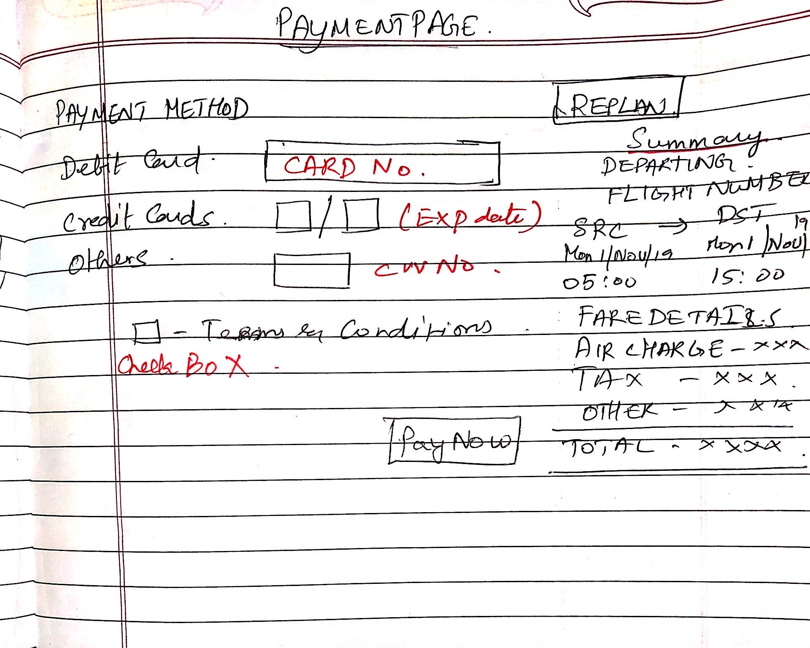

# Flight Fare Prediction

## 1)  How the application would look like ? Or What could be possible UI components his app would contain ?

**Initial Booking page**

After Search page - Listing the flights based on the search, getting the cheaper flights based on the prediction

Passenger details list

Payment

In addition to this there will be a page to add and update the flight list.

## 2 What would different backend components needs to be written for this platform ? – If you could list down specific services as well

Different components - MICRO SERVICES are listed as follows

1. **API Gateway** - Single entry point and that will manage which service the request has to hit and get the data. 
2. **User's Details** - Saves the user information.  *SQL database.*
3. **Flight Details** - Saves the flight details corresponding details, *SQL database.*
4. **Recommendation** - Where the machine algorithm runs and predicts the flight prices.
5. **Caching -**  Caching of data - *Redis server*
6. **Search -** Flight search - use something like *Elastic Search*
7. **Payment -** Payment gateway
8. **Logs** - Platform logs - *MongoDB*

## 3)	How would he store the metadata of the platform ?

Database schema with mapping

-c9bedfba-be29-4404-9e76-ed357fefa86a.png)

## 4 How would he build an API which would show the price prediction of future dates between 2 selected cities ?

   

Assumptions for training data

1. Day of Departure - If it is a weekday prices are low, on a weekend prices will be high. If possible we can also add holidays of the month and also predict if there are any long weekends in the month.
2. .Time of departure - Similar to day of departure, the time also seem to play an important factor.
Hence we divided all the flights into three categories: Morning (6am to noon),
Evening (noon to 9pm) and Night (9pm to 6am)
3. We are focusing on minimizing the flight prices, hence we considered only the economy class, later we can extend this to any class.
4. Suppose a user makes a query to buy a flight ticket 30 days in advance. Now group the data such a way, Airlines, Departure day, departure time, minimum fare ( airline might have offer on any specific flight id)

Training of Datasets & API conversion

1. I have uploaded the entire code base with a small flask application where user can select the date and see the prediction below.
2. There were few missing data which was filled with *dummy data* as of now.
3. All the date fields was in string, it was converted into date time field using *pandas*.
4. Also uploaded [jupyter notebook](https://github.com/kumaraswins/arch_diagram_flight_rate_prediction/blob/master/jupiter/flight_linear_reg.ipynb) file as well. (folder → flight_predict_prices/jupiter).

Refer to the [link](https://github.com/kumaraswins/arch_diagram_flight_rate_prediction/blob/master/jupiter/flight_linear_reg.ipynb)

Run the application

1. Create a python virtual environment, install all the dependencies in the *requirements.txt.*
2. In the index file where the core logic of training and test data will be present. It will present in the root folder.

    python index.py

1. Inside the root folder execute the following command.

        python __init_.py

    A basic flask server will be hosted in ***[localhost:5000](http://localhost:5000)***

You can the webpage as below.

## 5) This app would serve million of users. How would Chen actually plan to scale this as a full-fledged enterprise level platform ?

This will be built based on micro services architecture. Scaling will be easier by scaling each and every service separately based on the demand.

ARCHITECTURE DIAGRAM

## 6 How would he manage to handle different user permissions and login.

In the DB schema we will be having a table for maintaining different roles, while creating the user, the roles will be assigned, for example, Employee(admin) or User(passenger), later can be extended to any level.

We can define organisational level permission and also we can create multiple roles like profiles and assign to each and every user.

## 7 How would he think of supporting multiple languages or making it global ?

Assuming that the app labels or the static content are going to have multi lingual support.

This can be achieved to client side implementation. 

We have to create as many files as how many languages we have for example. English and French

We will be creating a markup like something like this.

    // This will be en(english) file
    {
    	"label_name":"home",
    	"content":"content text in selected language"
    }
    // This will be fr(french) file
    {
    	"label_name":"home",
    	"content":"contenu du texte dans la langue sélectionnée"
    }

The above format will have markup in the html file.

## 8 As Chen is planning to launch this application globally then he needs to have strategy to make this application up and available 24*7 across different time zones. How could he leverage any standard cloud offerings if necessary ?

We can write a CRON job by hitting the all the services regularly and get the status of each services, if there are any red flags we can intimate the admin by triggering, email, sms or even phone call based on the severity.